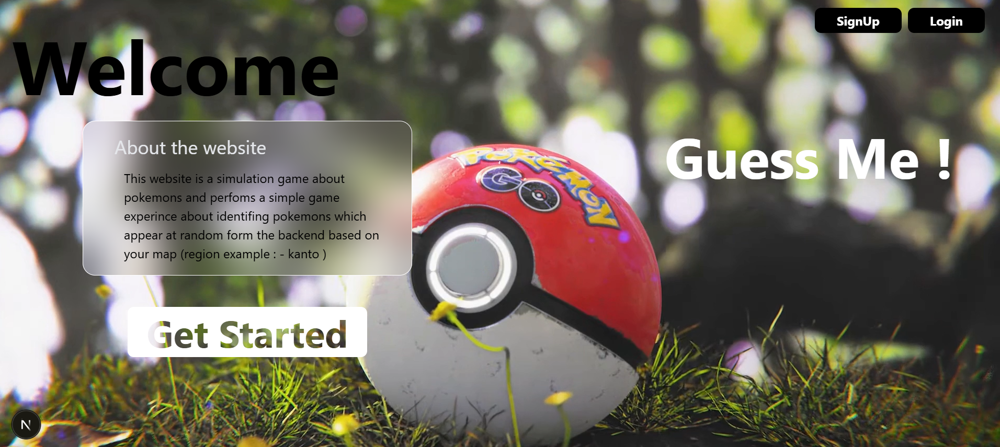
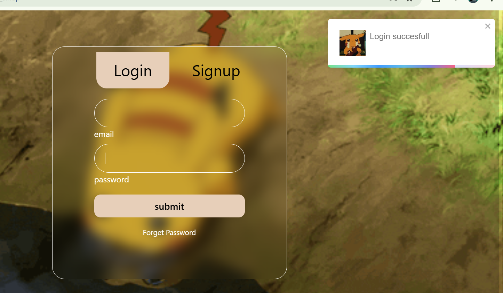
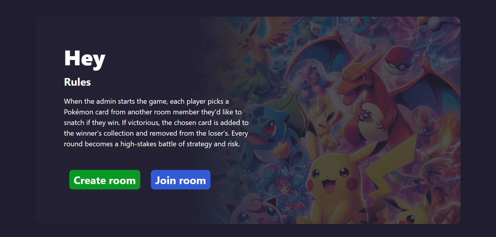

# Pokémon Guessing Game 🎮⚡

A real-time multiplayer Pokémon guessing game built with modern web technologies.  
Players can compete in **PvP mode** or play **Hunt mode** with synchronized real-time gameplay powered by Socket.IO.

---

## 🚀 Features

- ⚔️ Real-time multiplayer gameplay
- 🎯 PvP and Hunt game modes
- 🔄 Live synchronization using Socket.IO
- 🔐 Authentication and session management
- 👥 Room creation and player management
- 💾 MongoDB database integration
- 📡 Stable gameplay with disconnect recovery
- 🏠 Host migration support

---

## 🛠️ Tech Stack

### Frontend
- Next.js
- React.js

### Backend
- Node.js
- Express.js
- Socket.IO

### Database
- MongoDB

---

## 🏗️ Architecture

The project follows a distributed architecture where:

- **Next.js** handles the frontend and game interactions
- **Node.js + Express** manage APIs and WebSocket communication
- **Socket.IO** enables real-time multiplayer synchronization
- **MongoDB** stores players, rooms, sessions, and card decks

---

## 🎮 Game Modes

### PvP Mode
Compete against other players in real-time Pokémon guessing battles.

### Hunt Mode
A fast-paced mode focused on discovering and identifying Pokémon.

---

## ⚡ Multiplayer Features

- Real-time room synchronization
- Player disconnect handling
- Automatic host migration
- Session persistence
- Stable WebSocket communication

---

## 📂 Project Structure

```bash
project/
│
├── back-end-practice/           # Next.js frontend and Game play
    ├── public/                  # public Images and resoureces
    ├── src/                     # Main code Folder
        ├── app /                # Different page for game
            ├── user/            # login and sinnup
            ├── game/            # Game Page
            ├── api/             # api foder
            ├── multiplayer/     # Multiplayer page and game play
            ├── Context/         # Global context of app
             .....
      
    ├── Data model/               # Mongo Schema and data modles
    ├── db-connectioin/           # connection file to database
    ├── helper/                   # utilities funtions of app
        ├── get_id.js            # get user id
        ├── save_pokemon         # saving Catched Pokemin
        .....
    ├── middleware.js            # middlewar funtions

    
        
├── server/                     # Express + Socket.IO backend
    ├── name Space/             # different name space for socket connection
    ├── index.js                # Main working file

```

---

## 🧪 Installation

Clone the repository:

## For frontend and Playing version 
```bash
git https://github.com/not-adev/Guess-me
cd back-end-practice
```
## For multiplayer server
```bash
git https://github.com/not-adev/Guess-me
cd server
```

Install dependencies:

```bash
npm install
```

Run the development server:

```bash
npm run dev
```

---

## 🔑 Environment Variables

Create a `.env` file in the root directory:

```env
MONGODB_URI=your_mongodb_uri
JWT_SECRET=your_secret
PORT=5000
```

---

## 📸 Screenshots

Add screenshots of your project here.






---

## 🌟 Future Improvements

- Global leaderboard
- Matchmaking system
- Pokémon rarity system
- Improved mobile responsiveness
- Voice chat support

---

## 👨‍💻 Author

**Md Arif Ansari**

GitHub: https://github.com/not-adev
